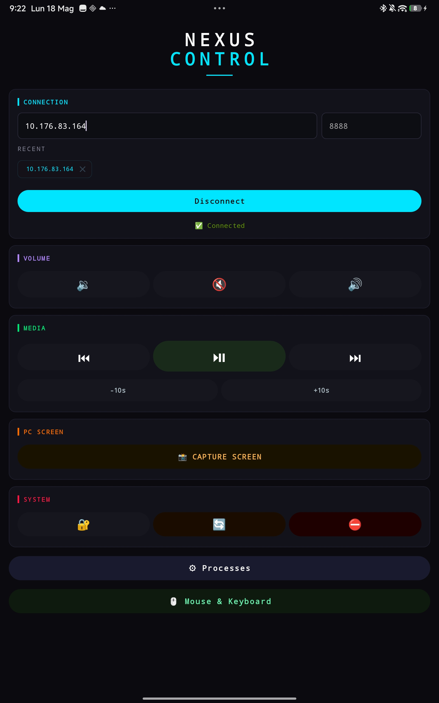
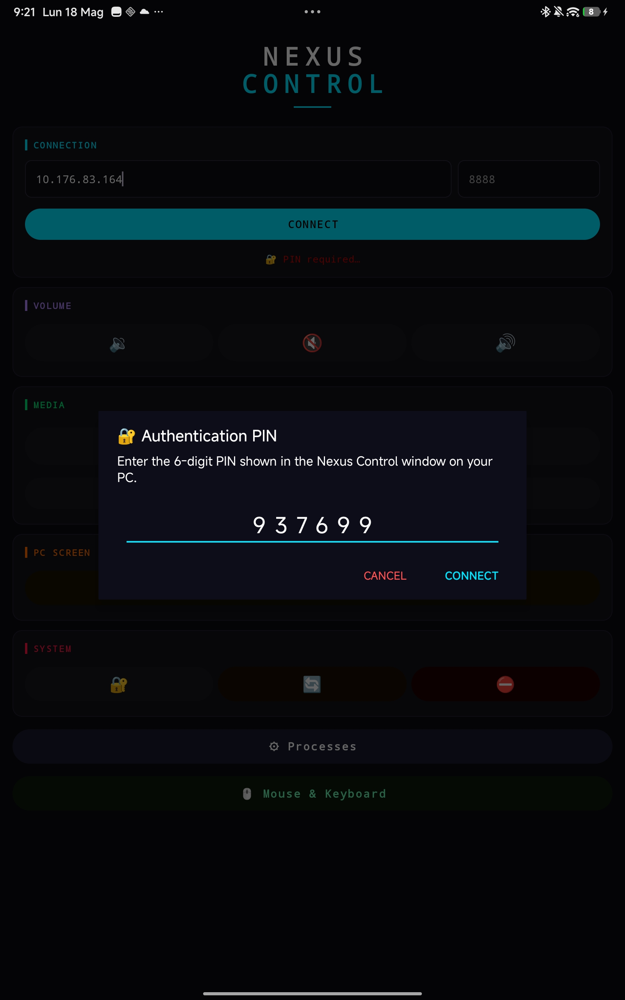
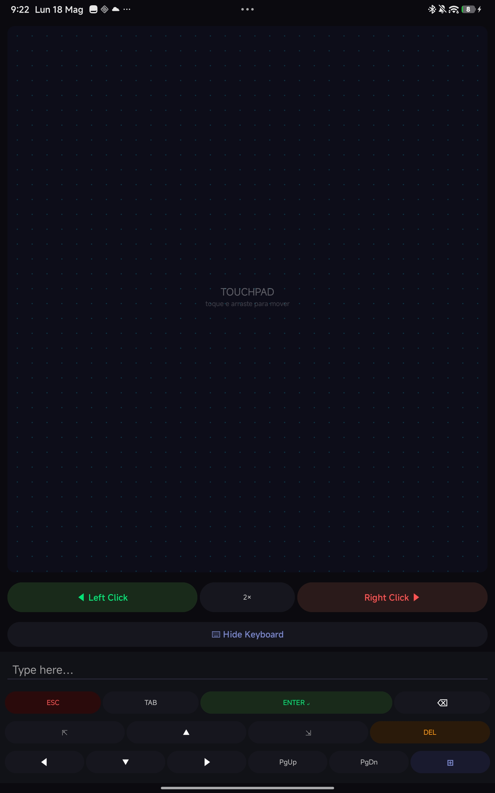
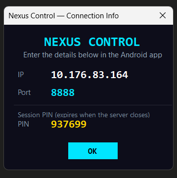

<div align="center">

# ⚡ NEXUS CONTROL

### Control your Windows PC from your Android phone — via raw TCP sockets, zero cloud.


</div>

---

## What is this?

Nexus Control is a **local-network remote control system** built from scratch with two components:

- A **Windows tray app** written in C# (.NET) that listens for commands
- An **Android app** written in native Java that sends those commands over a raw TCP socket

No cloud. No pairing service. No Bluetooth. Just your Wi-Fi, a socket, and direct Win32 API calls.

---

## Screenshots

<table>
  <tr>
    <td align="center"><b>Android — Main Screen</b></td>
    <td align="center"><b>Android — PIN Auth</b></td>
  </tr>
  <tr>
    <td></td>
    <td></td>
  </tr>
  <tr>
    <td align="center"><b>Android — Mouse & Keyboard</b></td>
    <td align="center"><b>Windows — Connection Info</b></td>
  </tr>
  <tr>
    <td></td>
    <td></td>
  </tr>
</table>

---

## Architecture Overview

```
┌─────────────────────────────────┐        ┌───────────────────────────────────┐
│        Android App (Java)       │        │      Windows Server (C#/.NET)     │
│                                 │        │                                   │
│  MainActivity                   │  TCP   │  SocketServer                     │
│  ├─ SocketClient ───────────────┼───────▶│  └─ HandleClient (thread/client)  │
│  ├─ CommandBuilder (JSON)       │        │     └─ CommandExecutor            │
│  ├─ MouseKeyboardActivity       │        │        ├─ Win32 SendInput         │
│  ├─ ProcessListActivity         │◀───────┼─────── ├─ NAudio (volume)         │
│  └─ ScreenshotViewer            │  JSON  │        ├─ GDI+ (screenshot)       │
│                                 │        │        └─ Process API             │
└─────────────────────────────────┘        └───────────────────────────────────┘
```

The Android side **sends JSON commands** → the C# side **parses, executes, and replies**.

---

## Features

| Category | Commands |
|---|---|
| 🔊 **Volume** | Volume Up / Down / Mute |
| 🎵 **Media** | Play/Pause, Next, Prev, Skip ±10s |
| 📸 **Screenshot** | Capture all monitors → JPEG → Base64 → view on phone with pinch-zoom |
| ⚙️ **Processes** | List all running processes, search by name, force-kill |
| 🖱️ **Mouse** | Touchpad with 1-finger move, 2-finger scroll, tap/double-tap, drag |
| ⌨️ **Keyboard** | Type any text, special keys (Esc, Tab, Enter, Win, arrows, etc.) |
| 💻 **System** | Lock workstation, Restart, Shutdown |
| 🔐 **PIN Auth** | Session PIN generated on server startup — expires when the server closes |

---

## How It Works

### Connection flow

```
Android                                                      Windows
   │                                                            │
   │──── TCP connect :8888 ───────────────────────────────────▶│
   │                                                           │  TcpListener.AcceptTcpClient()
   │◀────────────────────────────────── {"status":"CONNECTED"} │  Handshake
   │                                                           │
   │ {"cmd":"AUTH","pin":"937699"} ───────────────────────────▶│  PIN verification
   │◀───────────────────────────────────────── {"status":"OK"} │  Granted
   │                                                           │
   │ {"cmd":"MEDIA","acao":"VOLUME_UP"} ──────────────────────▶│
   │◀────────────────── {"status":"OK","msg":"Volume up: 65%"} │
   │                                                           │
   │ {"cmd":"SCREENSHOT"} ────────────────────────────────────▶│
   │◀─── {"status":"OK","capturas":[{"dados":"...base64..."}]} │
```

### JSON Protocol

All messages are single-line JSON terminated by `\n`.

**Send a command:**
```json
{ "cmd": "MEDIA", "acao": "VOLUME_UP" }
{ "cmd": "MOUSE", "acao": "MOVE", "dx": 12, "dy": -5 }
{ "cmd": "TECLADO", "texto": "hello world" }
{ "cmd": "KILL_PROCESS", "nome": "chrome" }
```

**Server response:**
```json
{ "status": "OK", "msg": "Volume up: 70%" }
{ "status": "ERROR", "msg": "Process not found: chrome" }
```

---

## Stack & Technical Choices

### Why C# for the server?
Win32 API integration is first-class in .NET. `SendInput`, `EnumDisplayMonitors`, `LockWorkStation`, NAudio for audio control — all available without any native binding boilerplate.

### Why native Java for Android?
To show real control over threading and networking. No Flutter magic. The socket runs on a background thread, UI callbacks are dispatched via `Handler(Looper.getMainLooper())`, and reconnection uses exponential backoff — all manual.

### Why raw TCP instead of HTTP/WebSocket?
Lower latency for mouse movement (which fires dozens of packets per second). A persistent socket connection also avoids the handshake overhead on every command.

---

## Project Structure

```
nexus-control/
│
├── assets/                  # Screenshots for README
│   ├── mainAPP.jpg
│   ├── pinAPP.jpg
│   ├── MouseKeyboard.jpg
│   └── mainServer.png
│
├── server/                  # C# .NET Windows app
│   ├── Program.cs           # Entry point, DPI awareness, WinForms bootstrap
│   ├── SocketServer.cs      # TcpListener, per-client threads
│   ├── CommandExecutor.cs   # Win32 API calls, NAudio, GDI+ screenshot
│   ├── TrayManager.cs       # System tray icon and context menu
│   ├── generate_icon.ps1    # Programmatic .ico generator (PowerShell)
│   └── build.bat            # One-click build → dist/NexusControl.exe
│
└── android/                 # Android Java app
    ├── SocketClient.java    # TCP connection, reconnect logic, JSON parsing
    ├── CommandBuilder.java  # Protocol: builds JSON strings for every command
    ├── MainActivity.java    # Main screen: connect, media, system controls
    ├── MouseKeyboardActivity.java  # Touchpad + virtual keyboard
    ├── TouchpadView.java    # Custom View: gesture detection (tap, drag, scroll)
    ├── ProcessListActivity.java    # Live process list with kill button
    ├── ScreenshotViewer.java       # Multi-monitor viewer with pinch-zoom
    └── ZoomableImageView.java      # Custom ImageView: pinch-to-zoom + pan
```

---

## Download

### Pre-built binaries (no .NET SDK required)

| Platform | Download |
|---|---|
| 🖥️ Windows x64 — Server | [**NexusControl.exe** → Releases](https://github.com/your-username/nexus-control/releases/latest) |
| 📱 Android APK (API 26+) | [**NexusControl.apk** → Releases](https://github.com/your-username/nexus-control/releases/latest) |

> The Windows build is **self-contained** — ships with the .NET runtime, no installation needed. Just download and run.

---

## Getting Started

### Server (Windows)

**Requirements:** .NET 8 SDK, Windows 10/11

```bash
# Clone the repo
git clone https://github.com/your-username/nexus-control.git
cd nexus-control/server

# Build and run
build.bat
```

The `.bat` script will:
1. Generate the tray icon programmatically via PowerShell
2. Compile and publish a self-contained `NexusControl.exe` to `/dist`
3. Open the output folder automatically

> The app runs silently in the **system tray** (near the clock). Double-click the tray icon to see your IP, port, and session PIN.

---

### Android App

**Requirements:** Android Studio, device or emulator with API 26+

```bash
cd nexus-control/android
# Open in Android Studio and run on device
```

Or build via Gradle:
```bash
./gradlew assembleRelease
```

---

### Connecting

1. Make sure your PC and Android are on the **same Wi-Fi network**
2. Launch `NexusControl.exe` on Windows — double-click the tray icon to see your IP, port, and **6-digit PIN**
3. Open the Android app, type the PC's IP and port `8888`, tap **CONNECT**
4. Enter the PIN shown on the PC when prompted — connection is granted instantly

> The PIN is generated fresh every time the server starts and expires when it closes. No one else on your network can connect without it.

---

## Known Challenges & Design Decisions

**Serialization across languages:** C# `Newtonsoft.Json` and Java `Gson` must agree on field names. All protocol fields are defined in `CommandBuilder.java` and matched in `CommandExecutor.cs` — changing the contract in one place breaks the other.

**Mouse latency:** `TouchpadView` fires `MOVE` events on every `ACTION_MOVE`. At SENSITIVITY = 1.8, small movements are amplified to feel natural over network latency.

**Screenshot size:** A 4K monitor generates ~8 MB of raw bitmap. JPEG at 75% quality brings it to ~300–600 KB. The Android socket reader uses a 1 MB buffer explicitly to avoid truncation.

**Reconnect strategy:** `SocketClient` uses linear backoff (`RECONNECT_DELAY × attempt`) up to `MAX_RECONNECTS = 5`. After that, the user must reconnect manually.

**Listener swapping:** `ProcessListActivity` and `MouseKeyboardActivity` temporarily steal the socket listener from `MainActivity` using `setListener()`. On `onDestroy()`, they return it. This avoids duplicate socket connections.

---

## Roadmap

- [ ] AES-encrypted socket channel
- [ ] Clipboard sync (copy on phone → paste on PC)
- [ ] File transfer
- [ ] Wake-on-LAN support
- [ ] Multi-client: let more than one phone connect simultaneously

---

## License

MIT — do whatever you want, just don't sell it as-is without adding something to it.